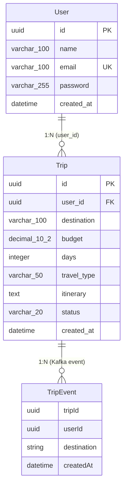

# TravelProject — DML / ER Diagram

## Database Mappings

| Database | Tables | Service | Port |
|----------|--------|---------|------|
| `travel_user_db` | `users` | user-service | 8081 |
| `travel_trip_db` | `trips` | trip-service | 8082 |

## Table Details

### `users` (travel_user_db)

| Column | Type | Constraints |
|--------|------|-------------|
| `id` | UUID | PK, `@GeneratedValue(UUID)` |
| `name` | VARCHAR(100) | NOT NULL |
| `email` | VARCHAR(100) | NOT NULL, UNIQUE |
| `password` | VARCHAR(255) | NOT NULL (BCrypt hash) |
| `created_at` | DATETIME | NOT NULL, `@PrePersist` |

### `trips` (travel_trip_db)

| Column | Type | Constraints |
|--------|------|-------------|
| `id` | UUID | PK, `@GeneratedValue(UUID)` |
| `user_id` | UUID | NOT NULL (logical FK → users.id) |
| `destination` | VARCHAR(100) | NOT NULL |
| `budget` | DECIMAL(10,2) | NOT NULL |
| `days` | INTEGER | NOT NULL |
| `travel_type` | VARCHAR(50) | NOT NULL |
| `itinerary` | TEXT | nullable |
| `status` | VARCHAR(20) | NOT NULL, default "generated" |
| `created_at` | DATETIME | NOT NULL, `@PrePersist` |

## Kafka Event (not persisted)

### `TripEvent` (topic: `trip-created`)

| Field | Type | Description |
|-------|------|-------------|
| `tripId` | UUID | Trip identifier |
| `userId` | UUID | Owner identifier |
| `destination` | String | Trip destination |
| `createdAt` | DateTime | Event timestamp |

## Relationships

- **User 1:N Trip** — A user can have multiple trips. The `trips.user_id` column references `users.id`. No explicit JPA `@ManyToOne`/`@OneToMany` is defined (microservices separate databases), but the logical foreign key exists.
- **Trip 1:N TripEvent** — Each created trip publishes one Kafka event to the `trip-created` topic for downstream consumers (notification-service).
